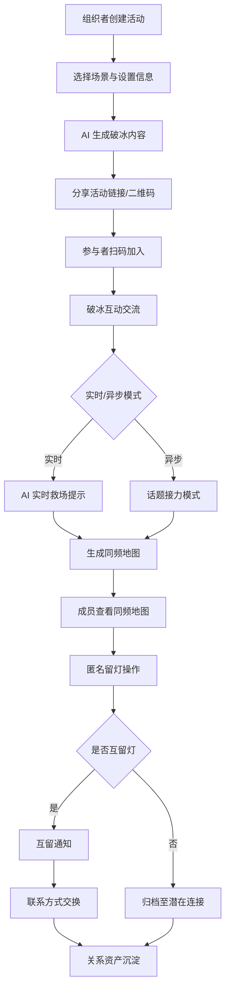

## 1. Product Overview
LinkUp 是一款面向短期合作场景（课程组队、项目协作、行业活动）的轻量级社交连接工具，帮助用户发现值得长期连接的人，并降低关系延续的心理成本。
- 解决四大核心问题：缺少自然认识对方的理由、不知道如何开启交流、关系沉淀与管理缺失、主动社交心理门槛过高
- 目标用户：参与短期合作场景的学生、职场人士、活动参与者
- 市场价值：将一次性合作关系转化为长期社交资产，提升社交效率与合作体验

## 2. Core Features

### 2.1 User Roles
| Role | Registration Method | Core Permissions |
|------|---------------------|------------------|
| 组织者 | 扫码/链接进入，创建活动 | 创建活动、管理成员、查看团队洞察、选择破冰内容 |
| 参与者 | 扫码/链接加入 | 参与破冰互动、查看同频地图、留灯、管理关系资产 |

### 2.2 Feature Module
1. **首页（场景选择）**: 展示核心场景入口、热门话题、最近活动记录、新手引导
2. **破冰互动页**: AI 生成问题与小游戏、实时互动、AI 救场提示
3. **同频地图页**: 团队认知可视化、共性标签云、连接线索展示
4. **留灯与连接页**: 成员列表、留灯操作、互留通知、联系方式交换
5. **个人中心**: 关系资产库、社交复盘报告、会员管理、隐私设置

### 2.3 Page Details
| Page Name | Module Name | Feature description |
|-----------|-------------|---------------------|
| 首页 | 场景卡片区 | 展示课程组队/项目合作/行业活动/兴趣社群四个场景入口 |
| 首页 | 热门话题展示 | 展示当前热门破冰话题与趋势 |
| 首页 | 最近活动记录 | 展示用户参与过的历史活动 |
| 首页 | 新手引导浮层 | 新用户首次使用时的引导提示 |
| 破冰互动页 | 问题展示区 | 展示 AI 生成的问题，含进度指示 |
| 破冰互动页 | 回答输入区 | 用户输入回答，支持匿名/昵称模式 |
| 破冰互动页 | 他人回答查看 | 实时查看其他成员的回答 |
| 破冰互动页 | AI 辅助提示条 | 在对话间隙提供救场提示 |
| 破冰互动页 | 小游戏互动区 | 观点站队/快速选择/匿名预测等轻量互动 |
| 同频地图页 | 共性标签云 | 展示团队共同兴趣标签的分布 |
| 同频地图页 | 兴趣分布图 | 可视化展示团队兴趣分布情况 |
| 同频地图页 | 连接线索卡片 | "你与3位成员有共同点"等连接提示 |
| 同频地图页 | 个人模式切换 | 切换查看与自己相关的连接 |
| 同频地图页 | 分享入口 | 分享同频地图生成社交工牌 |
| 留灯与连接页 | 成员列表 | 展示团队成员昵称与共同点标签 |
| 留灯与连接页 | 留灯操作按钮 | 匿名表达继续交流意愿，每次活动有限次数 |
| 留灯与连接页 | 互留通知中心 | 双方互留灯后通知 |
| 留灯与连接页 | 联系方式交换入口 | 互留后可选择交换联系方式 |
| 留灯与连接页 | 延续话题推荐包 | AI 推荐后续交流话题 |
| 个人中心 | 关系资产列表 | 按场景/时间筛选的历史连接记录 |
| 个人中心 | 连接记录详情 | 查看单次连接的详细信息 |
| 个人中心 | 社交画像卡片 | 展示个人社交偏好与效率洞察 |
| 个人中心 | 会员权益展示 | 免费版与 Pro 会员权益对比 |
| 个人中心 | 设置与隐私管理 | 隐私偏好、数据导出、账户管理 |

## 3. Core Process
用户通过扫码或链接进入活动房间，组织者选择场景后 AI 生成破冰内容，参与者互动交流后系统生成同频地图，用户对感兴趣的人留灯，互留后可交换联系方式，最终关系资产沉淀至个人库。

## 4. User Interface Design
### 4.1 Design Style
- **主色调**: 渐变紫蓝色 (#667eea → #764ba2) 作为品牌色
- **辅助色**: 柔和的粉色 (#f093fb)、青色 (#4facfe)、薄荷绿 (#43e97b)
- **按钮风格**: 圆角胶囊形状，带阴影和渐变效果
- **字体**: 现代无衬线字体，标题使用 Space Grotesk，正文使用 DM Sans
- **布局风格**: 卡片式布局，圆角设计，充足留白
- **图标风格**: 线性图标，圆角端点，统一 stroke 宽度
- **整体风格**: 年轻、活力、科技感，适合社交产品

### 4.2 Page Design Overview
| Page Name | Module Name | UI Elements |
|-----------|-------------|-------------|
| 首页 | 场景卡片区 | 大卡片设计，每个场景配独特渐变背景和图标，点击有悬浮动效 |
| 首页 | 热门话题展示 | 横向滚动的话题标签，带热度指示器 |
| 首页 | 最近活动记录 | 时间线式卡片列表 |
| 破冰互动页 | 问题展示区 | 居中大字号问题，底部进度指示器，问题卡片带渐变背景 |
| 破冰互动页 | 回答输入区 | 圆角输入框，支持字数统计，提交按钮带渐变 |
| 破冰互动页 | 他人回答查看 | 气泡式回答卡片，匿名模式显示为灰色头像 |
| 破冰互动页 | AI 辅助提示条 | 顶部提示条，带 AI 图标和渐入动画 |
| 破冰互动页 | 小游戏互动区 | 观点站队用左右分栏设计，快速选择用按钮组 |
| 同频地图页 | 共性标签云 | 圆形标签，大小表示重要性，颜色表示分类 |
| 同频地图页 | 兴趣分布图 | 环形图或柱状图，展示各类别占比 |
| 同频地图页 | 连接线索卡片 | 卡片列表，带成员头像和共同点标签 |
| 留灯与连接页 | 成员列表 | 横向卡片，成员头像+昵称+标签，底部留灯按钮 |
| 留灯与连接页 | 留灯操作 | 爱心/灯泡图标按钮，带动画反馈 |
| 个人中心 | 关系资产列表 | 时间线或网格布局，支持筛选标签 |
| 个人中心 | 社交画像卡片 | 仪表盘式设计，展示各项指标 |

### 4.3 Responsiveness
- 移动端优先设计（产品主要通过扫码在移动端使用）
- 桌面端自适应，展示完整交互体验
- 触控优化：按钮最小点击区域 44px

### 4.4 Motion Guidelines
- 页面切换使用平滑淡入淡出动画
- 卡片悬浮有轻微上移和阴影加深效果
- 留灯操作有爱心爆发式动画
- AI 提示条从顶部滑入
- 标签云生成时有渐显动画
