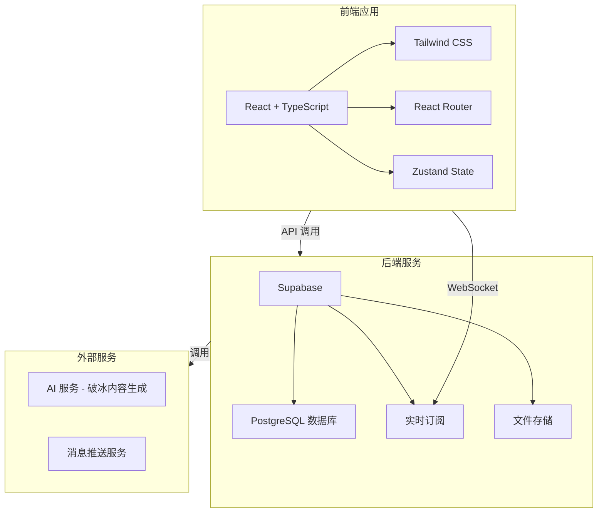
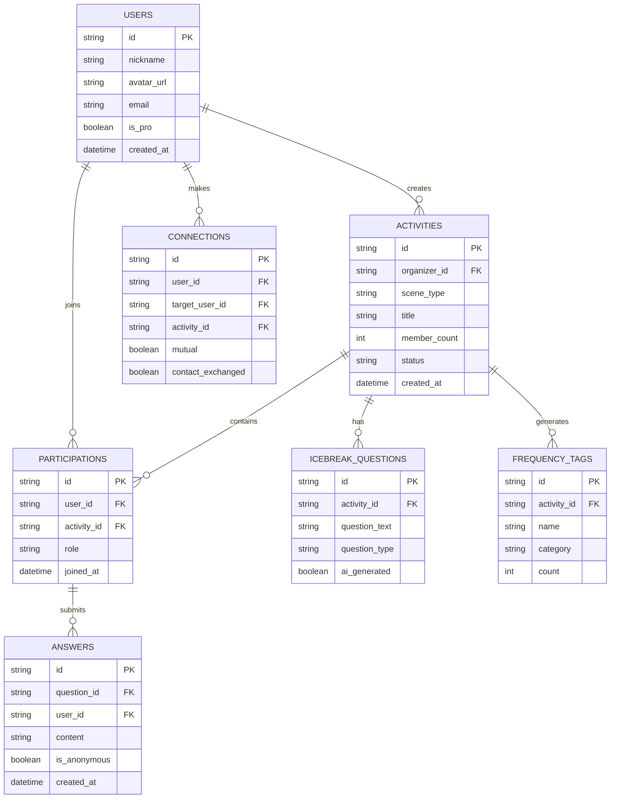

## 1. Architecture Design



## 2. Technology Description
- **Frontend**: React@18 + TypeScript + Tailwind CSS@3 + Vite
- **初始化工具**: vite-init
- **状态管理**: Zustand
- **路由**: React Router DOM@6
- **后端**: Supabase (PostgreSQL + Auth + Storage + Realtime)
- **图标库**: Lucide React
- **字体**: Google Fonts (Space Grotesk + DM Sans)

## 3. Route Definitions
| Route | Purpose |
|-------|---------|
| / | 首页 - 场景选择 |
| /icebreak | 破冰互动页 |
| /frequency-map | 同频地图页 |
| /connections | 留灯与连接页 |
| /profile | 个人中心 |

## 4. API Definitions
### 4.1 活动相关 API
```typescript
interface Activity {
  id: string;
  organizer_id: string;
  scene_type: 'course' | 'project' | 'industry' | 'hobby';
  title: string;
  member_count: number;
  status: 'draft' | 'active' | 'completed';
  created_at: string;
}

interface IcebreakQuestion {
  id: string;
  activity_id: string;
  question_text: string;
  question_type: 'open' | 'choice' | 'vote' | 'predict';
  options?: string[];
  ai_generated: boolean;
}
```

### 4.2 连接相关 API
```typescript
interface Connection {
  id: string;
  user_id: string;
  target_user_id: string;
  activity_id: string;
  mutual: boolean;
  created_at: string;
  contact_exchanged: boolean;
}

interface FrequencyTag {
  id: string;
  name: string;
  category: string;
  count: number;
  members: string[];
}
```

## 5. Data Model

### 5.1 Data Model Definition


### 5.2 Data Definition Language
```sql
-- 用户表
CREATE TABLE users (
    id UUID DEFAULT gen_random_uuid() PRIMARY KEY,
    nickname VARCHAR(50) NOT NULL,
    avatar_url VARCHAR(500),
    email VARCHAR(100) UNIQUE,
    is_pro BOOLEAN DEFAULT false,
    created_at TIMESTAMPTZ DEFAULT now()
);

-- 活动表
CREATE TABLE activities (
    id UUID DEFAULT gen_random_uuid() PRIMARY KEY,
    organizer_id UUID REFERENCES users(id),
    scene_type VARCHAR(20) CHECK (scene_type IN ('course', 'project', 'industry', 'hobby')),
    title VARCHAR(100) NOT NULL,
    member_count INT DEFAULT 0,
    status VARCHAR(20) DEFAULT 'draft',
    created_at TIMESTAMPTZ DEFAULT now()
);

-- 参与记录表
CREATE TABLE participations (
    id UUID DEFAULT gen_random_uuid() PRIMARY KEY,
    user_id UUID REFERENCES users(id),
    activity_id UUID REFERENCES activities(id),
    role VARCHAR(20) DEFAULT 'participant',
    joined_at TIMESTAMPTZ DEFAULT now()
);

-- 破冰问题表
CREATE TABLE icebreak_questions (
    id UUID DEFAULT gen_random_uuid() PRIMARY KEY,
    activity_id UUID REFERENCES activities(id),
    question_text TEXT NOT NULL,
    question_type VARCHAR(20) CHECK (question_type IN ('open', 'choice', 'vote', 'predict')),
    ai_generated BOOLEAN DEFAULT false
);

-- 回答表
CREATE TABLE answers (
    id UUID DEFAULT gen_random_uuid() PRIMARY KEY,
    question_id UUID REFERENCES icebreak_questions(id),
    user_id UUID REFERENCES users(id),
    content TEXT,
    is_anonymous BOOLEAN DEFAULT false,
    created_at TIMESTAMPTZ DEFAULT now()
);

-- 连接表
CREATE TABLE connections (
    id UUID DEFAULT gen_random_uuid() PRIMARY KEY,
    user_id UUID REFERENCES users(id),
    target_user_id UUID REFERENCES users(id),
    activity_id UUID REFERENCES activities(id),
    mutual BOOLEAN DEFAULT false,
    contact_exchanged BOOLEAN DEFAULT false
);

-- 同频标签表
CREATE TABLE frequency_tags (
    id UUID DEFAULT gen_random_uuid() PRIMARY KEY,
    activity_id UUID REFERENCES activities(id),
    name VARCHAR(50) NOT NULL,
    category VARCHAR(30),
    count INT DEFAULT 0
);

-- 启用行级安全策略
ALTER TABLE users ENABLE ROW LEVEL SECURITY;
ALTER TABLE activities ENABLE ROW LEVEL SECURITY;
ALTER TABLE connections ENABLE ROW LEVEL SECURITY;

-- 创建索引
CREATE INDEX idx_activities_organizer ON activities(organizer_id);
CREATE INDEX idx_participations_user ON participations(user_id);
CREATE INDEX idx_connections_user ON connections(user_id);
```

## 6. Project Structure
```
src/
├── components/
│   ├── SceneCard.tsx       # 场景卡片组件
│   ├── IcebreakQuestion.tsx # 破冰问题组件
│   ├── FrequencyMap.tsx    # 同频地图组件
│   ├── MemberCard.tsx      # 成员卡片组件
│   ├── ProfileCard.tsx     # 画像卡片组件
│   └── AIPrompt.tsx        # AI 提示组件
├── pages/
│   ├── Home.tsx            # 首页
│   ├── Icebreak.tsx        # 破冰互动页
│   ├── FrequencyMap.tsx    # 同频地图页
│   ├── Connections.tsx     # 留灯与连接页
│   └── Profile.tsx         # 个人中心
├── hooks/
│   └── useActivity.ts      # 活动管理 Hook
├── store/
│   └── useStore.ts         # 全局状态管理
├── utils/
│   └── constants.ts        # 常量配置
├── App.tsx
├── main.tsx
└── index.css
```
